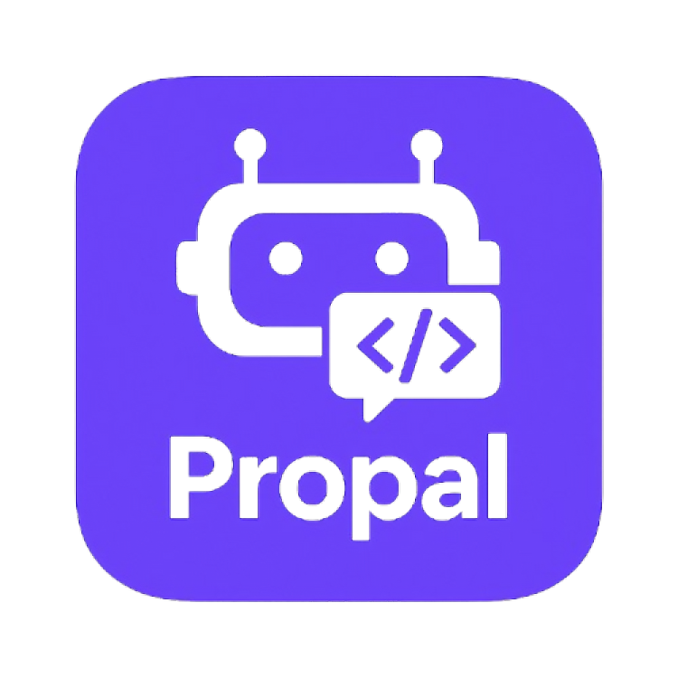

# Propal - AI Coding Assistant

A modern Flutter application that provides an intelligent coding assistant powered by Google's Gemini AI. Propal helps developers with coding questions, debugging, and programming guidance through a beautiful, secure interface.



## 🚀 Features

- **AI-Powered Coding Assistant**: Get instant help with coding questions using Google's Gemini AI
- **Secure Authentication**: Biometric authentication (fingerprint/face ID) support
- **Chat History**: Persistent chat sessions with secure local storage
- **User Profile Management**: Customizable user profiles with profile pictures
- **Modern UI**: Dark theme with beautiful animations and smooth transitions
- **Copy Functionality**: Easily copy AI responses to clipboard
- **Cross-Platform**: Works on Android, iOS, and other Flutter-supported platforms

## 📱 Screenshots

### Login & Authentication
- **Profile Setup**: Create your profile with a custom profile picture
- **Biometric Authentication**: Secure access with fingerprint or face ID
- **Settings**: Toggle biometric authentication and update profile

### Chat Interface
- **Modern Chat UI**: Clean, dark interface optimized for coding discussions
- **Session Management**: Create and manage multiple chat sessions
- **Copy Responses**: One-click copying of AI responses
- **Loading Animations**: Smooth loading indicators during AI processing

## 🛠️ Technical Stack

- **Frontend**: Flutter 3.3.0+
- **AI Integration**: Google Gemini AI API
- **Authentication**: Local authentication with biometric support
- **Storage**: Encrypted shared preferences for secure data storage
- **State Management**: Built-in Flutter state management
- **Animations**: Lottie animations for enhanced UX

## 📦 Dependencies

```yaml
dependencies:
  flutter: sdk: flutter
  cupertino_icons: ^1.0.6
  lottie: ^3.1.0
  google_generative_ai: ^0.4.7
  flutter_markdown: ^0.6.20+1
  iconsax: ^0.0.8
  google_fonts: ^6.2.1
  encrypt_shared_preferences: ^0.9.9
  flutter_dotenv: ^5.1.0
  shared_preferences: ^2.2.2
  local_auth: ^2.1.7
  image_picker: ^1.0.7
  cached_network_image: ^3.3.1
  uuid: ^4.0.0
```

## 🔧 Installation & Setup

### Prerequisites

1. **Flutter SDK**: Install Flutter 3.3.0 or higher
2. **Dart SDK**: Comes with Flutter
3. **Google AI API Key**: Get your API key from [Google AI Studio](https://makersuite.google.com/app/apikey)

### Setup Instructions

1. **Clone the repository**
   ```bash
   git clone https://github.com/yourusername/propal.git
   cd propal
   ```

2. **Install dependencies**
   ```bash
   flutter pub get
   ```

3. **Configure Environment Variables**
   ```bash
   # Copy the example environment file
   cp assets/creds/.env.example assets/creds/.env
   
   # Edit the .env file and add your Google AI API key
   # assets/creds/.env
   API_KEY=your_google_ai_api_key_here
   ```

4. **Platform-specific Setup**

   #### Android
   - Minimum SDK version: 21
   - Target SDK version: 34
   - Biometric authentication requires Android 6.0+
   
   #### iOS
   - Minimum iOS version: 11.0
   - Biometric authentication requires iOS 11.0+
   - Update `ios/Runner/Info.plist` for biometric permissions:
   ```xml
   <key>NSFaceIDUsageDescription</key>
   <string>This app uses Face ID for secure authentication</string>
   ```

5. **Run the application**
   ```bash
   flutter run
   ```

## 🔑 API Configuration

### Getting Google AI API Key

1. Visit [Google AI Studio](https://makersuite.google.com/app/apikey)
2. Sign in with your Google account
3. Create a new API key
4. Copy the API key to your `.env` file

### Environment Variables

Create `assets/creds/.env` file with:
```env
API_KEY=your_google_ai_api_key_here
```

⚠️ **Important**: Never commit your `.env` file to version control. It's already added to `.gitignore`.

## 🏗️ Project Structure

```
lib/
├── main.dart                 # App entry point
├── models/
│   ├── user.dart            # User model
│   └── chat_model.dart      # Chat message and session models
├── pages/
│   ├── login_page.dart      # User registration and profile setup
│   ├── biometric_auth_page.dart # Biometric authentication
│   ├── home_page.dart       # Main chat interface
│   └── settings_page.dart   # User settings
├── services/
│   ├── auth_service.dart    # Authentication logic
│   └── chat_service.dart    # AI chat functionality
├── repos/
│   └── chat_repo.dart       # Secure storage service
└── widgets/
    └── messagecard.dart     # Chat message widget
```

## 🔐 Security Features

- **Encrypted Storage**: All user data is encrypted using `encrypt_shared_preferences`
- **Biometric Authentication**: Secure app access with fingerprint/face ID
- **API Key Protection**: Environment variables prevent API key exposure
- **Local Data**: All data stored locally on device for privacy

## 🎨 UI/UX Features

- **Dark Theme**: Optimized for coding environments
- **Modern Design**: Material Design 3 principles
- **Smooth Animations**: Lottie animations for enhanced experience
- **Responsive Layout**: Works across different screen sizes
- **Copy Functionality**: Easy copying of AI responses
- **Loading States**: Clear feedback during AI processing

## 🚀 Usage

### First Launch
1. **Profile Setup**: Create your profile with name and optional profile picture
2. **Biometric Setup**: Choose whether to enable biometric authentication
3. **Start Chatting**: Begin asking coding questions immediately

### Daily Usage
1. **Authentication**: Use biometric authentication or skip if disabled
2. **Chat Sessions**: Create new sessions or continue existing ones
3. **Ask Questions**: Get help with coding problems, debugging, or learning
4. **Copy Responses**: Easily copy AI responses to your clipboard

## 🔧 Development

### Code Structure
- **Clean Architecture**: Separation of concerns with models, services, and UI
- **State Management**: Efficient state management with built-in Flutter solutions
- **Error Handling**: Comprehensive error handling throughout the app
- **Performance**: Optimized for smooth performance on all devices

### Contributing
1. Fork the repository
2. Create a feature branch
3. Make your changes
4. Add tests if applicable
5. Submit a pull request

## 📝 License

This project is licensed under the MIT License - see the [LICENSE](LICENSE) file for details.

## 🤝 Contributing

Contributions are welcome! Please feel free to submit a Pull Request. For major changes, please open an issue first to discuss what you would like to change.

## 📞 Support

If you encounter any issues or have questions:
1. Check the [Issues](https://github.com/yourusername/propal/issues) page
2. Create a new issue if your problem isn't already reported
3. Provide detailed information about your environment and the issue

## 🎯 Roadmap

- [ ] Voice input support
- [ ] Code syntax highlighting in responses
- [ ] Export chat history
- [ ] Custom AI model selection
- [ ] Team collaboration features
- [ ] Plugin system for IDE integration

## 🙏 Acknowledgments

- Google Gemini AI for powering the intelligent responses
- Flutter team for the amazing framework
- All contributors and users who help improve Propal

---

Made with ❤️ by developers, for developers

**Propal** - Your AI-powered coding companion


